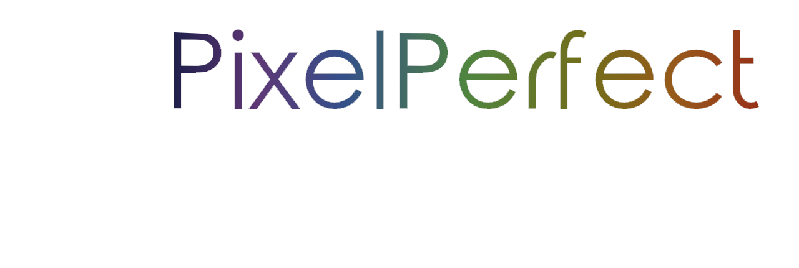
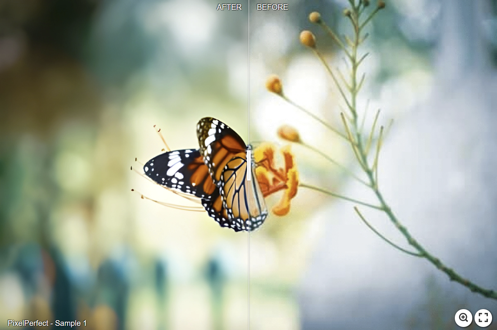
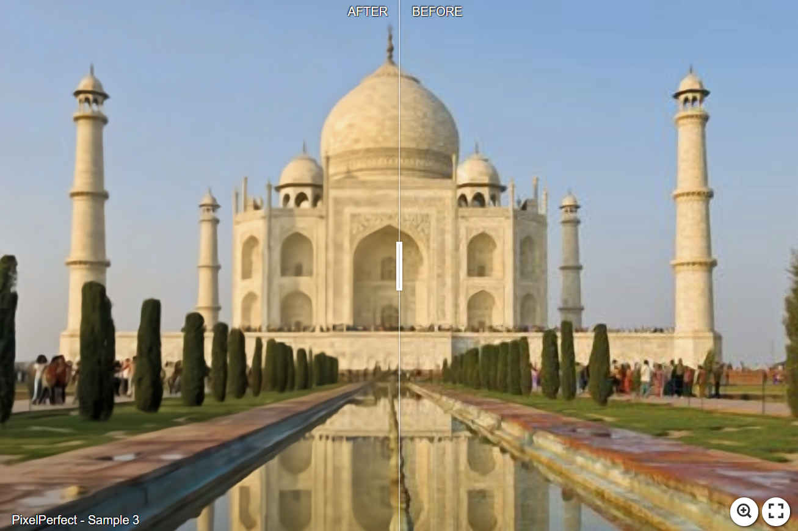
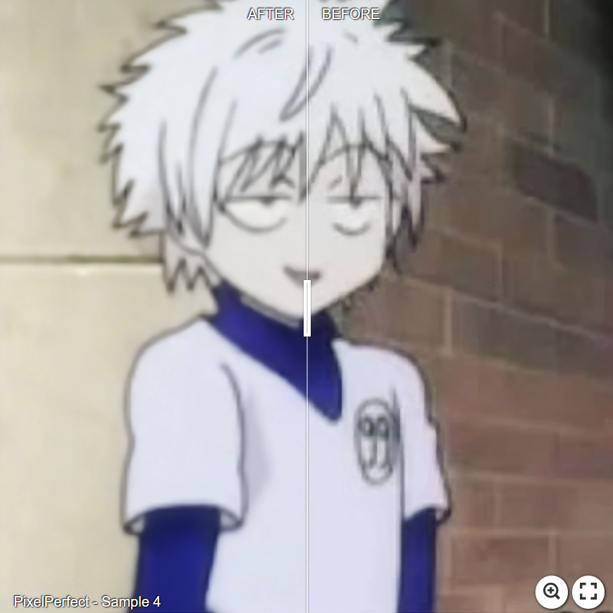

<p align="center">

</p>

# [PixelPerfect - Image Enhancement and Upscaling Web App](https://github.com/mkrol1997/pixel-perfect/)
[](https://github.com/mkrol1997/pixel-perfect/)
[](https://github.com/mkrol1997/pixel-perfect/releases)


 


# Contents

* [Description](#Description)
* [Visual Examples](#Visual-Examples)
* [Installation](#Installation-Guide)
* [Usage](#Usage)
* [Citation](#Citation)
________
Description
----------

Welcome to the PixelPerfect Web App, a versatile tool that empowers users to easily transform their images. Whether you're dealing with low-resolution photos, noisy images, or compression artefacts, our web app offers a comprehensive solution to enhance, upscale, and refine your visuals.

## Key Features:

### 1. Image Upscaling

Do your low-resolution images lack the detail and clarity you need? PixelPerfect allows you to increase the resolution of your images without compromising quality. Perfect for enhancing old photographs, small thumbnails, or web graphics, this feature breathes new life into your visuals.

### 2. Artifact Removal

Eliminate unwanted image artefacts that can detract from the overall quality of your pictures. Our app employs advanced algorithms to automatically detect and remove noise, compression artefacts, and distortions, ensuring that your images look their best.

### 3. Save Locally or to Google Drive

After enhancing and upscaling your images, you have the freedom to save the edited versions in two convenient ways:
- **Local Storage:** Save images directly to your local drive for easy access and offline use.
- **Google Drive Integration:** Seamlessly sync your edited images with your Google Drive account, making them accessible from anywhere.

### 4. User Accounts

Experience enhanced convenience by creating a dedicated user account within the web app. With your account, you can effortlessly save and manage your edited images, streamlining your workflow and facilitating future downloads.

### 5. Google OAuth2 Integration

Simplify the registration and login process with our seamless Google OAuth2 integration. You can create an account or log in using your Google credentials, ensuring a secure and frictionless user experience.

Whether you're a professional photographer, a graphic designer, or someone looking to improve their personal photos, PixelPerfect provides the tools you need to transform your images into sharper, more detailed visuals effortlessly.

Ready to elevate your images and streamline your image processing workflow? Sign up today or log in with your Google account to get started!

________
# Visual Examples
>Click on the image to view full-size

| [](https://imgsli.com/MjA2Mjcz) | [](https://imgsli.com/MjA2Mjcy) |
|:---:|:---:|
| [](https://imgsli.com/MjA2Mjcw) | [](https://imgsli.com/MjA2MjY3) |

________
# Installation Guide

  ### Prerequisites
    * Python 3.9+
    * Git 
    * Docker Desktop
    * Docker-compose (Linux)

1. **Clone the Repository:**

    ```bash
    git clone https://github.com/mkrol1997/pixel-perfect
    ```

2. **Navigate to the Project Directory:**

    ```bash
    cd pixel-perfect
    ```

3. **Build and Start Containers:**

    - Make sure you have Docker and Docker Compose installed and running.
    
    ```bash
    docker-compose up --build
    ```

4. **Access the App:**

    - Once the containers are running, access the app in your web browser.
    - Open your browser and enter the app's URL, which runs at `http://localhost:8000`.

5. **Shutdown and Cleanup:**

    ```bash
    docker-compose down
    ```

6. **Additional Configuration:**

    - To make sure all of the app features work correctly, it is essential to set all environmental variables listed in the .env file.

________
# Usage Instructions

## Image Upscaling

Image upscaling increases the resolution of old images by generating additional pixels.

**To properly use this functionality, follow these steps:**

1. Choose your image input.
2. Select one of the four supported upscaling methods:

   - **Resize Scale x2, x3, x4:**
     - ESPCN
     - FSRCNN
     - EDSR (Note: This method may take longer compared to others.)
     
   - **Resize Scale x2, x4, x8:**
     - LapSRN

3. Choose the desired scale according to the selected upscaling method.
4. *(Optional)* You can compress the image quality after upscaling to reduce its size:
   - Enable the switch button.
   - Choose the compression factor.
5. Save the image using the "Download" button or save it to Google Drive with the "Google Drive" button.

## Image Artefacts Removal

Image enhancement removes all artefacts from your picture. When choosing the enhancement factor, consider the trade-off between artefact removal and preserving fine image details.

**To properly remove artefacts, follow these steps:**

1. Choose your image input.
2. Select an image type from the available choices:
   - RGB image
   - Real-world RGB image
   - Greyscale image
3. Choose the enhancement factor.
4. Save the enhanced image using the "Download" button or save it to Google Drive with the "Google Drive" button.

## Image Full Enhancement

Full Enhancement combines image upscaling and artefacts removal.

**To perform full enhancement, follow these steps:**

1. Complete the steps for both the ["Image Upscaling"](#Image-Upscaling) and ["Image Artefacts Removal"](#Image-Artefacts-Removal) sections mentioned above.
________
# Citation

This project includes code from the [FBCNN by jiaxi-jiang](https://github.com/jiaxi-jiang/FBCNN) repository, which is based on the research work:

> "Towards Flexible Blind JPEG Artifacts Removal"
> - Jiaxi Jiang, Kai Zhang, Radu Timofte
> Proceedings of the IEEE/CVF International Conference on Computer Vision, 2021

    @inproceedings{jiang2021towards,
      title={Towards Flexible Blind JPEG Artifacts Removal},
      author={Jiang, Jiaxi and Zhang, Kai and Timofte, Radu},
      booktitle={Proceedings of the IEEE/CVF International Conference on Computer Vision},
      pages={4997--5006},
      year={2021}
      }

Please visit the original repository for more details on the code and to show your support by giving it a star.
      
________
# License and Acknowledgement

This project is licensed under the MIT License - see the [LICENSE](LICENSE) file for details.
