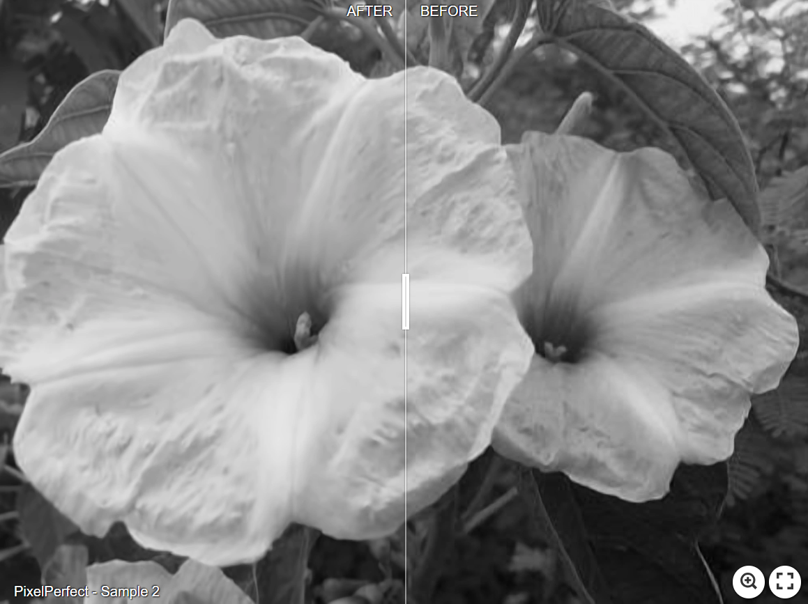

<p align="center">

</p>
# [PixelPerfect - Image Enhancement and Upscaling Web App](https://github.com/mkrol1997/pixel-perfect/)
[](https://github.com/mkrol1997/pixel-perfect/)
[](https://github.com/mkrol1997/pixel-perfect/releases)


 


# Contents

* [Description](#Description)
* [Visual Examples](#Visual-Examples)
* [Installation](#Installation-Guide)
* [Usage](#Usage)
* [Citation](#Citation)
________
Description
----------

Welcome to the PixelPerfect Web App, a versatile tool that empowers users to easily transform their images. Whether you're dealing with low-resolution photos, noisy images, or compression artefacts, our web app offers a comprehensive solution to enhance, upscale, and refine your visuals.

## Key Features:

### 1. Image Upscaling

Do your low-resolution images lack the detail and clarity you need? PixelPerfect allows you to increase the resolution of your images without compromising quality. Perfect for enhancing old photographs, small thumbnails, or web graphics, this feature breathes new life into your visuals.

### 2. Artifact Removal

Eliminate unwanted image artefacts that can detract from the overall quality of your pictures. Our app employs advanced algorithms to automatically detect and remove noise, compression artefacts, and distortions, ensuring that your images look their best.

### 3. Save Locally or to Google Drive

After enhancing and upscaling your images, you have the freedom to save the edited versions in two convenient ways:
- **Local Storage:** Save images directly to your local drive for easy access and offline use.
- **Google Drive Integration:** Seamlessly sync your edited images with your Google Drive account, making them accessible from anywhere.

### 4. User Accounts

Experience enhanced convenience by creating a dedicated user account within the web app. With your account, you can effortlessly save and manage your edited images, streamlining your workflow and facilitating future downloads.

### 5. Google OAuth2 Integration

Simplify the registration and login process with our seamless Google OAuth2 integration. You can create an account or log in using your Google credentials, ensuring a secure and frictionless user experience.

Whether you're a professional photographer, a graphic designer, or someone looking to improve their personal photos, PixelPerfect provides the tools you need to transform your images into sharper, more detailed visuals effortlessly.

Ready to elevate your images and streamline your image processing workflow? Sign up today or log in with your Google account to get started!

________
# Visual Examples
>Click on the image to view full-size

| [](https://imgsli.com/MjA2Mjcz) | [](https://imgsli.com/MjA2Mjcy) |
|:---:|:---:|
| [](https://imgsli.com/MjA2Mjcw) | [](https://imgsli.com/MjA2MjY3) |

________
# Installation Guide

  ### Prerequisites
    * Python 3.9+
    * Git 
    * Docker Desktop
    * Docker-compose (Linux)

1. **Clone the Repository:**

    ```bash
    git clone https://github.com/mkrol1997/pixel-perfect
    ```

2. **Navigate to the Project Directory:**

    ```bash
    cd pixel-perfect
    ```

3. **Build and Start Containers:**

    - Make sure you have Docker and Docker Compose installed and running.
    
    ```bash
    docker-compose up --build
    ```

4. **Access the App:**

    - Once the containers are running, access the app in your web browser.
    - Open your browser and enter the app's URL, which runs at `http://localhost:8000`.

5. **Shutdown and Cleanup:**

    ```bash
    docker-compose down
    ```

6. **Additional Configuration:**

    - To make sure all of the app features work correctly, it is essential to set all environmental variables listed in the .env file.

________
# Usage


________
# Citation

##### FBCNN, ICCV 2021
``` plaintext
Jiang, J. (2023). FBCNN: Convolutional Neural Network for Fine-Grained Text Classification.
Source code retrieved from: https://github.com/jiaxi-jiang/FBCNN
